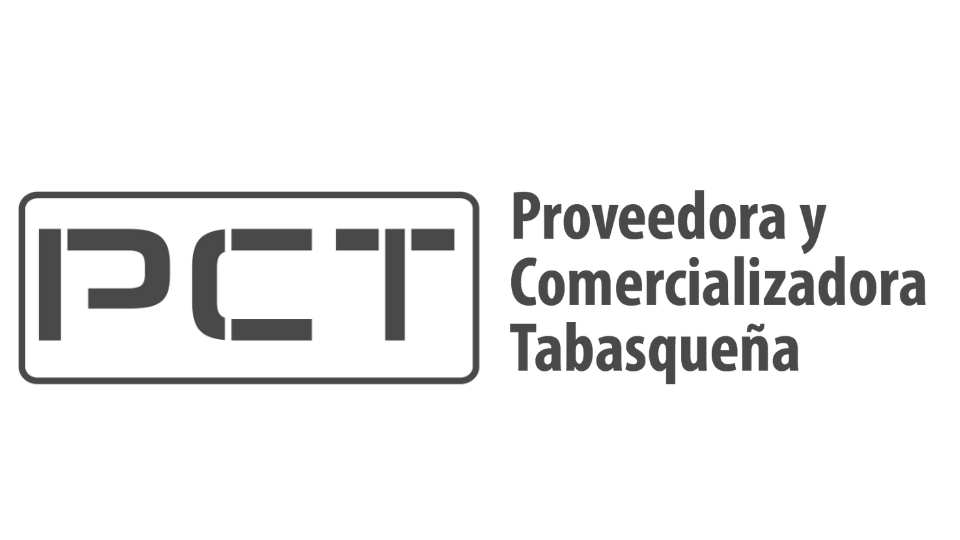

# 🎨 Cambios de Logo y Bullets - PCT

## ✅ Cambios Realizados

### 1. **❌ Audio Ambiental Eliminado**
- Eliminado `audio-ambient.js` (¡sonaba fatal! 😂)
- Eliminado `AUDIO_AMBIENTAL.md`
- Removido script del `index.html`

### 2. **🏷️ Logo Actualizado a logosch.png**

#### **Archivos Modificados:**
- ✅ `index.html` - Favicon y header
- ✅ `aviso.html` - Favicon y header
- ✅ `servicios/carretes-adaptadores.html`
- ✅ `servicios/carretes-espaciadores.html`
- ✅ `servicios/bridas-adaptadoras.html`
- ✅ `servicios/lineas-superficiales.html`
- ✅ `servicios/presas-ecologicas.html`
- ✅ `servicios/lavado-presas.html`

#### **Cambios:**
```html
<!-- Antes -->
<link rel="icon" href="img/logo.png" type="image/png">


<!-- Después -->
<link rel="icon" href="img/logosch.png" type="image/png">

```

### 3. **📍 Bullets Personalizados con Logo**

#### **CSS Agregado:**
```css
.content-section ul li,
.spec-list li,
.mission-box ul li,
.vision-box ul li {
    list-style: none;
    position: relative;
    padding-left: 35px;
    margin-bottom: 12px;
}

.content-section ul li::before,
.spec-list li::before,
.mission-box ul li::before,
.vision-box ul li::before {
    content: '';
    position: absolute;
    left: 0;
    top: 2px;
    width: 20px;
    height: 20px;
    background-image: url('img/logosch.png');
    background-size: contain;
    background-repeat: no-repeat;
    background-position: center;
    opacity: 0.8;
}
```

#### **Dónde Aplica:**
- ✅ Listas en sección "Nosotros"
- ✅ Listas en especificaciones de servicios
- ✅ Listas en Misión y Visión
- ✅ Todas las listas `<ul>` en content-section

---

## 🎯 Resultado Visual

### **Antes:**
- Bullets estándar (•)
- Logo genérico

### **Después:**
- ✅ Logo PCT como bullet en todas las listas
- ✅ Logo corporativo en favicon
- ✅ Logo corporativo en header
- ✅ Consistencia visual total

---

## 📊 Archivos Afectados

| Archivo | Cambio |
|---------|--------|
| index.html | Favicon + Header logo |
| aviso.html | Favicon + Header logo |
| style.css | Bullets personalizados |
| servicios/*.html (6 archivos) | Favicon |
| **ELIMINADOS** | audio-ambient.js, AUDIO_AMBIENTAL.md |

---

## 🚀 Para Subir a GitHub

```bash
git add -A
git commit -m "Logo corporativo y bullets personalizados"
git push origin main
```

---

**Fecha**: 28 de octubre de 2025  
**Versión**: 4.1 - Logo Corporativo  
**Cambio**: Eliminado audio + Logo PCT en bullets
